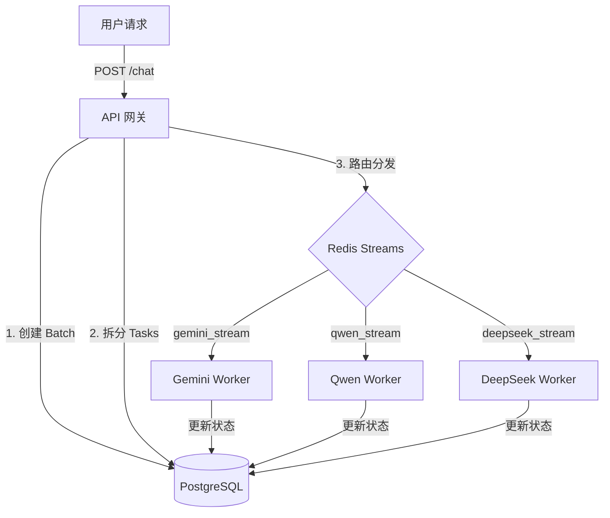

# 🚀 AI Task System (Enterprise Async Architecture)

这是一个基于 **FastAPI**、**Redis Streams** 和 **PostgreSQL** 构建的企业级异步 AI 任务处理系统。

本项目采用了先进的 **Master-Detail (批次-任务)** 架构，支持**请求扇出 (Request Fan-out)**，即一次用户请求可以同时触发多个 AI 模型（如 Gemini, Qwen, DeepSeek）并行处理。系统实现了生产级的高并发、高可用与故障恢复机制。

## 🌟 核心特性

* **⚡ 扇出架构 (Fan-out)**:
* 支持单次请求指定多个模型（例如 `"model": "gemini-flash, deepseek-r1"`）。
* 网关自动将请求拆分为多个独立的子任务 (`Task`)，并行分发到不同的 Redis Stream。


* **🏗️ 主从表设计 (Batch & Task)**:
* **ChatBatch (主表)**: 记录用户的一次完整请求生命周期。
* **Task (子表)**: 记录每个具体模型的执行结果、耗时与状态。


* **🔄 智能路由与多模型支持**:
* `gemini-*` → **Gemini Worker** (支持软拒绝检测与 Google 登录保活)
* `qwen-*` / `llama-*` → **Qwen/Ollama Worker** (通用本地模型)
* `deepseek-*` → **DeepSeek Worker** (支持 R1 推理与深度思考)


* **🛡️ 生产级可靠性**:
* **崩溃恢复**: Worker 启动时自动扫描 Redis PEL (Pending Entries List) 恢复未确认任务。
* **幂等性设计**: 防止网络抖动导致的任务重复执行。
* **日志开关**: 通过 `.env` 中的 `ENABLE_DB_LOG` 一键控制是否将错误堆栈写入数据库，防止日志爆炸。


## 📂 项目结构

```text
ai-task-system/
├── api-gateway/
│   ├── server.py            # 核心网关：负责 Batch 创建、任务拆分与 Redis 路由
│   └── Dockerfile           # 网关容器化配置
├── workers/
│   ├── gemini/              # Google Gemini 专用 Worker
│   ├── qwen/                # 通用 Ollama/Qwen Worker
│   └── deepseek/            # DeepSeek R1 专用 Worker
├── shared/                  # 共享内核
│   ├── database.py          # 数据库连接池 (带 Pool Pre-Ping)
│   ├── models.py            # SQLAlchemy 模型 (ChatBatch, Task, Conversation)
│   ├── schemas.py           # Pydantic 验证模型
│   └── utils/               # 日志与工具类
├── init/
│   └── init_db.py           # 数据库初始化脚本
├── .env                     # 配置文件
└── requirements.txt         # 项目依赖

```

## 🛠️ 快速开始

### 1. 环境准备

确保本地已安装 **PostgreSQL** (推荐 v14+) 和 **Redis**。

```bash
# 1. 克隆项目
git clone https://github.com/Hiih-u/AI-task-system.git
cd ai-task-system

# 2. 创建虚拟环境
python -m venv venv
source venv/bin/activate  # Windows: venv\Scripts\activate

# 3. 安装依赖
pip install -r requirements.txt

```

### 2. 配置文件

复制 `.env.example` 为 `.env` 并修改配置：

```ini
# .env
DB_HOST=127.0.0.1
POSTGRES_USER=postgres
POSTGRES_PASSWORD=your_password

# Redis
REDIS_HOST=127.0.0.1

# AI 服务地址 (根据你的实际情况配置)
GEMINI_SERVICE_URL=http://localhost:61080/v1/chat/completions
LLM_SERVICE_URL=http://192.168.202.155:11434/v1/chat/completions  # Ollama/Qwen
DEEPSEEK_SERVICE_URL=http://192.168.202.155:11434/v1/chat/completions # DeepSeek

GEMINI_WORKER_ID=gemini-worker-01
QWEN_WORKER_ID=qwen-worker-01
DEEPSEEK_WORKER_ID=deepseek-worker-01


# 日志开关 (False=生产环境不写库)
ENABLE_DB_LOG=False

```

### 3. 初始化数据库

**⚠️ 注意**：此操作会清空现有表结构！

```bash
python init/init_db.py

```

*看到 `✅ 数据库表结构同步完成！` 即表示成功。*

### 4. 启动服务

建议在不同的终端窗口中运行：

**终端 1: API 网关**

```bash
python api-gateway/server.py
# 或使用 uvicorn (生产推荐)
# uvicorn api-gateway.server:app --host 0.0.0.0 --port 8000

```

**终端 2: 启动 Workers (按需启动)**

```bash
# 启动 Gemini 工人
python workers/gemini/gemini_worker.py

# 启动 DeepSeek 工人
python workers/deepseek/deepseek_worker.py

# 启动 Qwen/Ollama 工人
python workers/qwen/qwen_worker.py

```

## 🔌 API 接口使用指南

### 1. 提交并发任务 (Fan-out)

一次请求，让多个模型同时回答。

* **Endpoint**: `POST /v1/chat/completions`
* **Payload**:
```json
{
  "prompt": "如何用 Python 读取 CSV 文件？",
  "model": "gemini-2.5-flash, deepseek-r1:1.5b", 
  "conversation_id": null
}

```


*注意：`model` 字段支持逗号分隔。*
* **Response**:
```json
{
  "batch_id": "batch-uuid-1234...",
  "conversation_id": "conv-uuid-5678...",
  "message": "Tasks dispatched successfully",
  "task_ids": ["task-1...", "task-2..."]
}

```


### 2. 轮询批次结果

查看所有模型的执行进度和结果。

* **Endpoint**: `GET /v1/batches/{batch_id}`
* **Response**:
```json
{
  "batch_id": "batch-uuid-1234...",
  "status": "PROCESSING",
  "results": [
    {
      "model_name": "gemini-2.5-flash",
      "status": 1, 
      "response_text": "使用 pandas 库...",
      "cost_time": 1.2
    },
    {
      "model_name": "deepseek-r1:1.5b",
      "status": 0,
      "response_text": null
    }
  ]
}

```


### 3. 查看会话历史

* **Endpoint**: `GET /v1/conversations/{conversation_id}/history`

## 🧠 核心逻辑图解



## ❓ 常见问题

**Q: 如何接入 DeepSeek R1？**
A: 确保你本地运行了 Ollama (`ollama run deepseek-r1:1.5b`)，然后在 `.env` 中配置 `DEEPSEEK_SERVICE_URL` 指向 Ollama 地址，前端请求时 `model` 填入 `deepseek` 即可自动路由。

**Q: 数据库报错 `server closed the connection unexpectedly`？**
A: 系统已集成 `pool_pre_ping=True` 机制自动处理断连，如果依然出现，请检查 Postgres 容器内存是否充足。

**Q: 如何扩展 Worker 性能？**
A: 可以在多台机器上启动同一个 Worker 脚本，只需在 `.env` 中修改 `WORKER_ID` 即可自动组成消费者组进行负载均衡。